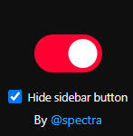

# Youtube Short remover

> AI was used for documentation purposes, not a single line of code was written by AI.

This browser extension can dynamically remove Shorts from your Youtube Feed.
It does not remove them from the search page.

## Features

This extension can:
- show or hide shorts
- redirect shorts URLs to the standard video player
- hide the "Shorts" button on the sidebar

## Setup

### For Chrome, Edge, Opera, Brave:

1. Download or clone this repository.
2. Open your browser's extensions page (`chrome://extensions`, `edge://extensions`, or the equivalent URL).
3. Enable **Developer mode**.
4. Click **Load unpacked**.
5. Select the project folder containing `manifest.json`.

### For Firefox:

1. Download or clone this repository.
2. Open `about:debugging#/runtime/this-firefox`.
3. Click **Load Temporary Add-on**.
4. Select the project's `manifest.json` file.

The extension remains installed until Firefox restarts. After editing the source files, reload it from the browser's extensions or debugging page.
